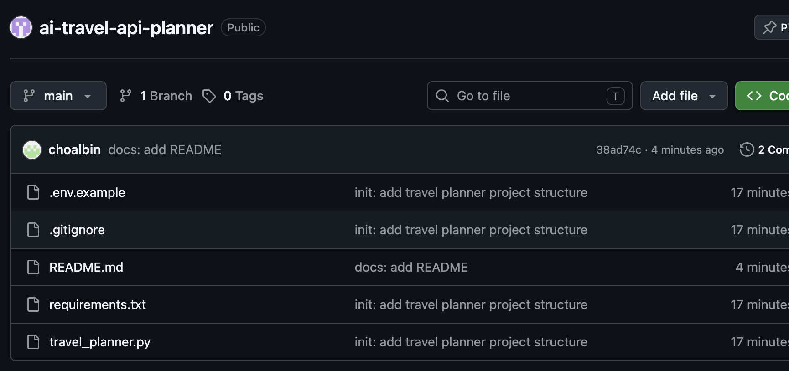

# AI 국내 여행 추천 CLI 프로그램

## 1. 프로젝트 소개

이 프로젝트는 사용자가 여행 날짜를 입력하면 LLM API와 지도/장소 검색 API를 조합하여 국내 여행 추천 리포트를 생성하는 CLI 기반 Python 프로그램입니다.

사용자가 `-date "YYYY-MM-DD"` 형식으로 여행 날짜를 입력하면, 프로그램은 먼저 LLM API를 통해 해당 시기에 여행하기 좋은 국내 지역을 추천받습니다. 이후 추천된 지역명을 Kakao Local API의 장소 검색 입력값으로 사용하여 맛집 정보를 검색하고, 최종적으로 LLM API를 다시 호출해 Markdown 형식의 여행 리포트를 생성합니다.

단일 API 호출이 아니라, LLM API의 구조화된 출력 결과를 다음 API 호출의 입력으로 연결하는 흐름을 구현한 것이 핵심입니다.

---

## 2. 프로젝트 목표

- REST API 요청/응답 구조 이해
- HTTP GET/POST 방식의 차이 이해
- LLM 출력 결과를 JSON으로 구조화하여 다음 단계 입력으로 활용
- 외부 API 호출 시 발생할 수 있는 오류 처리
- API 키를 코드에 직접 작성하지 않고 환경 변수로 관리
- 여러 API 결과를 조합하여 최종 Markdown 리포트 생성

---

## 3. 사용 기술

| 구분 | 사용 기술 |
|---|---|
| Language | Python 3.10+ |
| CLI | argparse |
| LLM API | Google Gemini API |
| Place API | Kakao Local API |
| HTTP Request | requests |
| Environment Variables | python-dotenv |
| Result Format | JSON, Markdown |
| Version Control | Git, GitHub |

---

## 4. 주요 기능

### 4.1 CLI 입력

프로그램은 터미널에서 실행되며, 여행 날짜를 필수 옵션으로 입력받습니다.

```bash
python3 travel_planner.py -date "2026-03-15"
```

또는 다음과 같이 실행할 수 있습니다.

```bash
python3 travel_planner.py --date "2026-03-15"
```

날짜 형식이 `YYYY-MM-DD`가 아니면 오류 메시지를 출력하고 종료합니다.

---

### 4.2 LLM API를 통한 1차 여행지 추천

입력된 날짜를 기준으로 Gemini API에 국내 여행지 추천을 요청합니다.

LLM 응답은 다음과 같은 JSON 구조로 파싱됩니다.

```json
{
  "recommended_city": "제주",
  "weather": "3월 중순의 제주는 비교적 온화하며 봄꽃을 즐기기 좋은 시기입니다.",
  "events": [
    "유채꽃 관련 지역 행사",
    "봄 시즌 지역 축제"
  ],
  "reason": "3월 중순은 제주가 봄 분위기를 느끼기 좋은 시기입니다. 야외 활동에 적합하고 관광지 접근성도 좋습니다."
}
```

필수 키는 다음과 같습니다.

| Key | Type | 설명 |
|---|---|---|
| recommended_city | string | 추천 지역 |
| weather | string | 해당 시기의 일반적 날씨 요약 |
| events | array | 행사/축제 후보 |
| reason | string | 추천 근거 |

---

### 4.3 Kakao Local API를 통한 맛집 검색

LLM이 추천한 지역명을 Kakao Local API 검색어로 사용합니다.

예를 들어 추천 지역이 `제주`이면 다음과 같은 검색어를 사용합니다.

```text
제주 맛집
```

Kakao Local API 응답에서 다음 정보를 추출합니다.

| 필드 | 설명 |
|---|---|
| name | 장소 이름 |
| address | 주소 |
| category | 카테고리 |
| url | 카카오맵 장소 URL |
| x | 경도 |
| y | 위도 |

검색 결과는 권장 기준에 맞춰 최대 5곳을 저장합니다.

---

### 4.4 최종 Markdown 여행 리포트 생성

1차 추천 JSON과 맛집 검색 결과를 다시 LLM API에 전달하여 최종 여행 리포트를 생성합니다.

리포트에는 다음 항목이 포함됩니다.

- 추천 지역
- 추천 이유
- 날씨 요약
- 행사/축제
- 맛집 추천
- 1일 일정 제안
- 오류 요약(errors)

---

### 4.5 결과 저장

프로그램 실행 후 `results/` 폴더에 결과 파일이 저장됩니다.

예시:

```text
results/
├── 2026-03-15_raw_data.json
└── 2026-03-15_travel_plan.md
```

`raw_data.json`에는 1차 추천 JSON, 맛집 검색 결과, 오류 목록이 저장됩니다.

`travel_plan.md`에는 최종 여행 리포트가 Markdown 형식으로 저장됩니다.

---

## 5. 프로젝트 구조

```text
ai-travel-api-planner/
├── travel_planner.py
├── README.md
├── requirements.txt
├── .env.example
├── .gitignore
├── results/
│   ├── 2026-03-15_raw_data.json
│   └── 2026-03-15_travel_plan.md
└── screenshots/
    ├── 01_project_structure.png
    ├── 02_env_example.png
    ├── 03_cli_run.png
    ├── 04_results_folder.png
    ├── 05_raw_json.png
    ├── 06_markdown_report.png
    ├── 07_error_handling.png
    └── 08_github_repo.png
```

---

## 6. 설치 방법

### 6.1 저장소 clone

```bash
git clone https://github.com/choalbin010201/ai-travel-api-planner.git
cd ai-travel-api-planner
```

### 6.2 패키지 설치

```bash
python3 -m pip install -r requirements.txt
```

`requirements.txt`에는 다음 라이브러리가 포함됩니다.

```txt
google-genai
python-dotenv
requests
```

---

## 7. API 키 설정 방법

이 프로젝트는 Gemini API와 Kakao Local API를 사용합니다.

필요한 환경 변수는 다음과 같습니다.

| 환경 변수 | 설명 |
|---|---|
| GEMINI_API_KEY | Google Gemini API 키 |
| KAKAO_REST_API_KEY | Kakao Developers의 REST API 키 |
| GEMINI_MODEL | 사용할 Gemini 모델명, 선택 사항 |

### 7.1 `.env.example`

제출용 예시 파일에는 실제 키를 넣지 않습니다.

```env
GEMINI_API_KEY=your_gemini_api_key_here
KAKAO_REST_API_KEY=your_kakao_rest_api_key_here
GEMINI_MODEL=gemini-2.5-flash
```

### 7.2 `.env`

실제 실행 시에는 프로젝트 루트에 `.env` 파일을 만들고 실제 키를 입력합니다.

```env
GEMINI_API_KEY=실제_Gemini_API_키
KAKAO_REST_API_KEY=실제_Kakao_REST_API_키
GEMINI_MODEL=gemini-2.5-flash
```

`.env` 파일은 GitHub에 업로드하지 않습니다.

---

## 8. 보안 주의사항

API 키는 외부 서비스 사용 권한을 가진 민감한 정보이므로 코드에 직접 작성하지 않았습니다.

API 키를 코드나 README에 직접 작성하지 않는 이유는 다음과 같습니다.

- GitHub에 실수로 공개되는 것을 방지하기 위해
- 키가 노출되어 무단 사용되거나 비용이 발생하는 것을 막기 위해
- 키를 교체하더라도 코드를 수정하지 않기 위해
- 협업 환경에서도 안전하게 프로젝트를 공유하기 위해

이를 위해 `.env` 파일을 사용하고, `.gitignore`에 다음 항목을 추가했습니다.

```gitignore
.env
__pycache__/
*.pyc
.DS_Store
```

---

## 9. 실행 방법

다음 명령어로 프로그램을 실행합니다.

```bash
python3 travel_planner.py -date "2026-03-15"
```

정상 실행 예시는 다음과 같습니다.

```text
[1/3] 1차 추천 생성 중(LLM)...
  - recommended_city: "제주"
[2/3] 맛집 검색 중(지도/장소 API)...
  - 맛집 5곳 검색 완료
[3/3] 최종 리포트 생성 중(LLM)...
  - 리포트 생성 완료

완료!
원본 데이터 JSON: results/2026-03-15_raw_data.json
최종 여행 리포트: results/2026-03-15_travel_plan.md
```

---

## 10. 결과물 확인 방법

### 10.1 원본 데이터 JSON 확인

```bash
cat results/2026-03-15_raw_data.json
```

원본 JSON에는 다음 정보가 포함됩니다.

```json
{
  "date": "2026-03-15",
  "recommendation": {
    "recommended_city": "제주",
    "weather": "날씨 요약",
    "events": ["행사 후보"],
    "reason": "추천 이유"
  },
  "restaurants": [
    {
      "name": "맛집 이름",
      "address": "주소",
      "category": "카테고리",
      "url": "장소 URL",
      "x": "경도",
      "y": "위도"
    }
  ],
  "errors": []
}
```

### 10.2 최종 Markdown 리포트 확인

```bash
cat results/2026-03-15_travel_plan.md
```

리포트는 다음 형식을 포함합니다.

```text
# 2026-03-15 국내 여행 추천 리포트

## 추천 지역
## 추천 이유
## 날씨 요약
## 행사/축제
## 맛집 추천
## 1일 일정 제안
## 오류 요약(errors)
```

---

## 11. 오류 처리

이 프로젝트는 외부 API 사용 중 발생할 수 있는 오류를 `try-except`로 처리합니다.

### 11.1 API 키 미설정

Gemini API 키 또는 Kakao REST API 키가 설정되지 않은 경우, 프로그램은 즉시 종료하고 설정 방법을 안내합니다.

```text
[오류] API 키가 설정되지 않았습니다.
누락된 키: GEMINI_API_KEY, KAKAO_REST_API_KEY
```

### 11.2 날짜 형식 오류

날짜 형식이 `YYYY-MM-DD`가 아니면 사용 예시를 출력하고 종료합니다.

```text
[오류] 날짜 형식이 올바르지 않습니다.
사용 예시: python travel_planner.py -date "2026-03-15"
```

### 11.3 LLM JSON 파싱 실패

LLM 응답이 JSON으로 파싱되지 않으면 1회 재요청합니다.

재요청에서도 실패하면 오류 메시지를 출력하고 종료합니다.

### 11.4 지도/장소 API 실패

Kakao Local API 호출이 실패하더라도 프로그램은 중단되지 않습니다.

인증 실패, 네트워크 오류, 쿼터 초과, 검색 결과 0건 등이 발생하면 맛집 섹션을 `데이터 없음`으로 처리하고 최종 리포트 생성을 계속 진행합니다.

오류 내용은 `errors` 배열에 저장됩니다.

예시:

```json
{
  "errors": [
    {
      "step": "place_search",
      "type": "AUTH_ERROR",
      "message": "HTTP 403"
    }
  ]
}
```

---

## 12. API 요청/응답 흐름

이 프로그램의 전체 흐름은 다음과 같습니다.

```text
사용자 입력 날짜
→ Gemini API 호출
→ 추천 지역 JSON 생성
→ recommended_city 추출
→ Kakao Local API 호출
→ 맛집 검색 결과 JSON 수집
→ Gemini API 재호출
→ 최종 Markdown 여행 리포트 생성
→ results/ 폴더에 JSON과 MD 저장
```

### REST API와 HTTP 메서드

Kakao Local API는 HTTP GET 방식으로 호출했습니다.

GET 방식은 주로 서버에서 데이터를 조회할 때 사용하며, 검색어와 같은 조건을 query parameter로 전달합니다.

LLM API는 SDK를 통해 호출했지만, 개념적으로는 사용자의 프롬프트를 서버에 보내고 AI 응답을 받는 요청/응답 구조로 동작합니다.

---

## 13. 스크린샷

### 13.1 프로젝트 폴더 구조


### 13.2 환경 변수 예시 파일


### 13.3 CLI 실행 화면


### 13.4 결과 폴더 생성 화면


### 13.5 원본 JSON 결과


### 13.6 최종 Markdown 리포트


### 13.7 오류 처리 화면


### 13.8 GitHub 저장소 화면



---

## 14. 테스트 결과

| 테스트 항목 | 결과 |
|---|---|
| `-date` 입력 실행 | 정상 |
| 날짜 형식 검증 | 정상 |
| Gemini API 추천 JSON 생성 | 정상 |
| LLM JSON 파싱 | 정상 |
| Kakao Local API 장소 검색 | 정상 |
| 맛집 검색 결과 저장 | 정상 |
| 최종 Markdown 리포트 생성 | 정상 |
| 결과 JSON 파일 저장 | 정상 |
| API 키 미설정 오류 처리 | 정상 |
| 지도 API 실패 시 리포트 계속 생성 | 정상 |

---

## 15. 구현 과정에서 이해한 점

이번 프로젝트를 통해 API를 단순히 한 번 호출하는 것이 아니라, 한 API의 결과를 다음 API의 입력으로 연결하는 방식을 경험했습니다.

특히 LLM API가 생성한 `recommended_city` 값을 구조화된 JSON으로 파싱한 뒤, 이 값을 Kakao Local API의 검색어로 사용하는 흐름을 구현했습니다.

또한 외부 API는 인증 오류, 네트워크 오류, 쿼터 초과, 파싱 오류 등이 발생할 수 있기 때문에 예외 처리가 중요하다는 점을 확인했습니다.

API 키는 코드에 직접 작성하지 않고 `.env` 파일과 환경 변수를 통해 관리했습니다. 이를 통해 GitHub에 코드를 공개하더라도 민감한 키가 노출되지 않도록 했습니다.

---

## 16. 프로젝트 요약

AI 국내 여행 추천 CLI 프로그램은 사용자가 입력한 날짜를 기준으로 LLM API가 여행지를 추천하고, Kakao Local API가 해당 지역의 맛집 정보를 검색한 뒤, 최종 Markdown 여행 리포트를 생성하는 프로그램입니다.

이 프로젝트는 CLI 입력, REST API 호출, LLM JSON 파싱, API 간 데이터 연결, 예외 처리, 결과 파일 저장, 환경 변수 기반 API 키 관리까지 포함한 API 연동 실습 프로젝트입니다.
