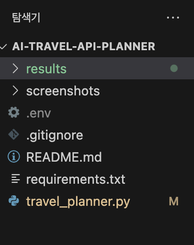
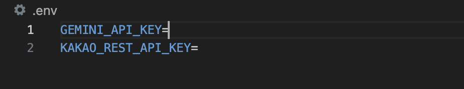
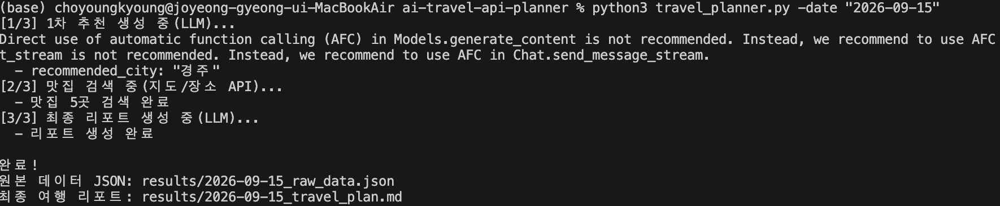
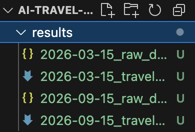
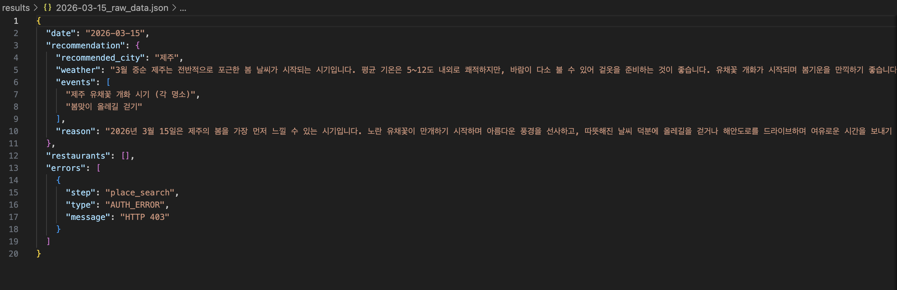
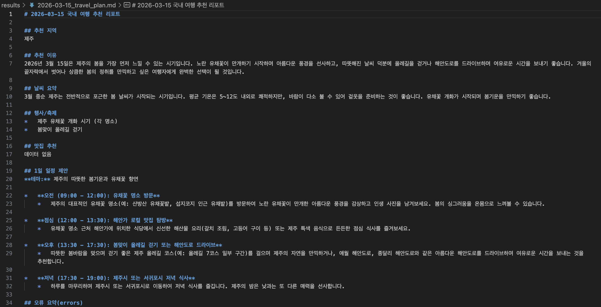
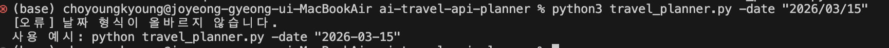

# AI 국내 여행 추천 CLI 프로그램

## 1. 프로젝트 소개

이 프로젝트는 사용자가 여행 날짜를 입력하면 **LLM API**와 **Kakao Local API**를 순서대로 호출하여 국내 여행 추천 리포트를 생성하는 CLI 기반 Python 프로그램입니다.

사용자는 터미널에서 `-date "YYYY-MM-DD"` 형식으로 여행 날짜를 입력합니다. 프로그램은 먼저 Gemini API를 통해 해당 날짜에 여행하기 좋은 국내 지역을 추천받고, 이 결과를 JSON으로 파싱합니다. 이후 JSON의 `recommended_city` 값을 Kakao Local API의 검색어로 사용하여 맛집 정보를 검색합니다. 마지막으로 1차 추천 JSON과 맛집 검색 결과를 다시 LLM에 전달하여 최종 Markdown 여행 리포트를 생성합니다.

이 프로젝트의 핵심은 단순히 API를 한 번 호출하는 것이 아니라, **한 API의 출력 결과를 다음 API의 입력값으로 연결하여 최종 결과물을 만드는 흐름**을 구현한 것입니다.

---

## 2. 프로젝트 목표

- REST API의 요청/응답 구조 이해
- HTTP GET/POST 방식의 차이 이해
- LLM 출력 결과를 JSON으로 구조화
- 구조화된 JSON 결과를 다음 API 호출의 입력으로 활용
- 외부 API 호출 시 발생하는 인증/쿼터/네트워크/파싱 오류 처리
- API 키를 코드에 직접 작성하지 않고 `.env` 또는 환경변수로 관리
- 원본 JSON 데이터와 최종 Markdown 리포트 저장
- 같은 날짜 재실행 시 기존 raw data를 재사용하는 간단한 캐시 흐름 구현

---

## 3. 사용 기술

| 구분 | 사용 기술 |
|---|---|
| Language | Python 3.10+ |
| CLI | argparse |
| LLM API | Google Gemini API |
| Place API | Kakao Local API |
| HTTP Request | requests |
| Environment Variables | python-dotenv |
| Result Format | JSON, Markdown |
| Version Control | Git, GitHub |

---

## 4. 프로젝트 구조

```text
ai-travel-api-planner/
├── travel_planner.py
├── README.md
├── requirements.txt
├── .env.example
├── .gitignore
├── results/
│   ├── 2026-03-15_raw_data.json
│   └── 2026-03-15_travel_plan.md
└── screenshots/
    ├── 01_project_structure.png
    ├── 02_env_example.png
    ├── 03_cli_run.png
    ├── 04_results_folder.png
    ├── 05_raw_json.png
    ├── 06_markdown_report.png
    ├── 07_error_handling.png
    ├── 08_cache_reuse.png
    └── 09_github_repo.png
```

---

## 5. 설치 및 실행 방법

### 5.1 패키지 설치

```bash
python3 -m pip install -r requirements.txt
```

`requirements.txt`

```txt
google-genai
python-dotenv
requests
```

### 5.2 프로그램 실행

```bash
python3 travel_planner.py -date "2026-03-15"
```

또는:

```bash
python3 travel_planner.py --date "2026-03-15"
```

### 5.3 실행 결과 예시

```text
[1/3] 1차 추천 생성 중(LLM)...
  - recommended_city: "제주"
[2/3] 맛집 검색 중(지도/장소 API)...
  - 맛집 5곳 검색 완료
[3/3] 최종 리포트 생성 중(LLM)...
  - 리포트 생성 완료

완료!
원본 데이터 JSON: results/2026-03-15_raw_data.json
최종 여행 리포트: results/2026-03-15_travel_plan.md
```

---

## 6. API 키 설정 방법

필요한 환경 변수는 다음과 같습니다.

| 환경 변수 | 설명 |
|---|---|
| GEMINI_API_KEY | Google Gemini API 키 |
| KAKAO_REST_API_KEY | Kakao Developers의 REST API 키 |
| GEMINI_MODEL | 사용할 Gemini 모델명, 선택 사항 |

`.env.example`에는 실제 키가 아닌 예시값만 작성합니다.

```env
GEMINI_API_KEY=your_gemini_api_key_here
KAKAO_REST_API_KEY=your_kakao_rest_api_key_here
GEMINI_MODEL=gemini-2.5-flash
```

실제 실행 시에는 프로젝트 루트에 `.env` 파일을 만들고 실제 키를 입력합니다.

```env
GEMINI_API_KEY=실제_Gemini_API_키
KAKAO_REST_API_KEY=실제_Kakao_REST_API_키
GEMINI_MODEL=gemini-2.5-flash
```

`.env` 파일은 GitHub에 업로드하지 않습니다.

---

## 7. 보안 주의사항

API 키는 외부 서비스 사용 권한을 가진 민감한 정보이므로 코드에 직접 작성하지 않았습니다.

API 키를 코드나 README에 직접 작성하지 않는 이유는 다음과 같습니다.

- GitHub에 실수로 공개되는 것을 방지하기 위해
- 키가 노출되어 무단 사용되거나 비용이 발생하는 것을 막기 위해
- 키를 교체하더라도 코드를 수정하지 않기 위해
- 협업 환경에서도 안전하게 프로젝트를 공유하기 위해

`.gitignore`에는 다음 항목을 추가했습니다.

```gitignore
.env
__pycache__/
*.pyc
.DS_Store
```

---

## 8. 주요 기능

### 8.1 CLI 입력 처리

`argparse`를 사용하여 CLI 옵션을 처리합니다.

필수 입력값:

```text
-date "YYYY-MM-DD"
```

날짜 형식이 올바르지 않으면 사용 예시를 출력하고 프로그램을 종료합니다.

```text
[오류] 날짜 형식이 올바르지 않습니다.
사용 예시: python travel_planner.py -date "2026-03-15"
```

### 8.2 LLM API를 통한 1차 여행지 추천

Gemini API에 날짜를 전달하여 국내 추천 여행지를 생성합니다.

1차 추천 JSON 필수 스키마:

| Key | Type | 설명 |
|---|---|---|
| recommended_city | string | 추천 지역 |
| weather | string | 해당 시기의 일반적 날씨 요약 |
| events | array | 행사/축제 후보 1~3개 |
| reason | string | 추천 근거 2~4문장 |

예시:

```json
{
  "recommended_city": "제주",
  "weather": "3월 중순의 제주는 비교적 온화하며 봄꽃을 즐기기 좋은 시기입니다.",
  "events": ["유채꽃 관련 지역 행사", "봄 시즌 지역 축제"],
  "reason": "3월 중순은 제주가 봄 분위기를 느끼기 좋은 시기입니다. 야외 활동에 적합하고 관광지 접근성도 좋습니다."
}
```

### 8.3 Kakao Local API를 통한 맛집 검색

LLM이 추천한 지역명을 Kakao Local API 검색어로 사용합니다.

예:

```text
제주 맛집
```

Kakao Local API 응답에서 다음 정보를 추출합니다.

| 필드 | 설명 |
|---|---|
| name | 장소 이름 |
| address | 주소 |
| category | 카테고리 |
| url | 카카오맵 장소 URL |
| x | 경도 |
| y | 위도 |

### 8.4 최종 Markdown 여행 리포트 생성

1차 추천 JSON과 맛집 검색 결과를 다시 Gemini API에 전달하여 최종 여행 리포트를 생성합니다.

리포트에는 다음 항목이 포함됩니다.

- 추천 지역
- 추천 이유
- 날씨 요약
- 행사/축제
- 맛집 추천
- 1일 일정 제안
- 오류 요약(errors)

### 8.5 결과 저장

프로그램 실행 후 `results/` 폴더에 결과 파일이 저장됩니다.

```text
results/
├── 2026-03-15_raw_data.json
└── 2026-03-15_travel_plan.md
```

---

## 9. 함수별 역할

| 함수 | 역할 |
|---|---|
| parse_args() | argparse를 사용해 `-date` 또는 `--date` 입력 처리 |
| validate_date() | 날짜가 `YYYY-MM-DD` 형식인지 검증 |
| check_api_keys() | `.env` 또는 환경변수에서 API 키 존재 여부 확인 |
| extract_json_from_text() | LLM 응답에서 JSON 부분만 추출 |
| validate_recommendation_schema() | 추천 JSON의 필수 키와 타입 검사 |
| normalize_city_name() | 지도 API 검색에 사용하기 쉽도록 도시명 일부 정규화 |
| get_travel_recommendation() | Gemini API를 호출하여 1차 추천 JSON 생성 |
| search_restaurants() | Kakao Local API를 호출하여 맛집 검색 |
| generate_markdown_report() | 추천 JSON과 맛집 데이터를 바탕으로 최종 Markdown 리포트 생성 |
| generate_fallback_report() | 최종 리포트 생성 실패 시 기본 Markdown 리포트 생성 |
| get_cached_raw_data() | 같은 날짜의 raw_data.json이 이미 있으면 기존 데이터 불러오기 |
| save_report_only() | 캐시 사용 시 최종 Markdown 리포트만 다시 저장 |
| save_results() | 원본 JSON과 최종 Markdown 파일 저장 |
| main() | 전체 실행 흐름 제어 |

---

## 10. 전체 실행 흐름

```text
사용자 입력 날짜
→ argparse로 CLI 인자 처리
→ 날짜 형식 검증
→ .env에서 API 키 확인
→ results/{date}_raw_data.json 캐시 존재 여부 확인
→ 캐시가 있으면 기존 추천 JSON과 맛집 목록 재사용
→ 캐시가 없으면 Gemini API 호출
→ 추천 지역 JSON 생성
→ JSON 필수 키와 타입 검증
→ recommended_city 추출
→ 도시명 정규화
→ Kakao Local API 호출
→ 맛집 검색 결과 정규화
→ Gemini API 재호출
→ 최종 Markdown 여행 리포트 생성
→ results/ 폴더에 raw_data.json과 travel_plan.md 저장
```

---

## 11. LLM JSON 검증 방식

LLM 응답은 항상 완전한 JSON으로만 반환된다고 보장할 수 없습니다.

따라서 다음 절차를 사용했습니다.

1. LLM 응답 문자열을 받습니다.
2. 응답에 JSON 코드블록이 포함되어 있으면 제거합니다.
3. 문자열에서 JSON 객체 부분을 추출합니다.
4. `json.loads()`로 파싱합니다.
5. 필수 키가 있는지 확인합니다.
6. 각 필수 키의 타입이 맞는지 검사합니다.

검증 대상 필수 키:

```text
recommended_city: string
weather: string
events: list
reason: string
```

---

## 12. LLM JSON 파싱 실패 시 재시도 전략

LLM이 JSON이 아닌 설명 문장이나 잘못된 형식의 응답을 반환할 수 있기 때문에, JSON 파싱 실패 시 1회 재시도하도록 설계했습니다.

재시도 프롬프트에서는 다음 조건을 더 강하게 요청합니다.

```text
설명 문장 없이 JSON만 출력
필수 키만 포함
Markdown 코드블록 사용 금지
recommended_city, weather, events, reason 포함
```

재시도는 최대 1회만 수행합니다. 무한 재시도를 하지 않는 이유는 API 비용과 실행 지연을 방지하기 위해서입니다.

---

## 13. REST API와 HTTP 메서드 설명

### 13.1 GET

GET은 서버에서 데이터를 조회할 때 주로 사용하는 HTTP 메서드입니다.

이 프로젝트에서 Kakao Local API는 장소 정보를 검색하는 용도이므로 GET 방식으로 호출했습니다.

```text
GET /v2/local/search/keyword.json?query=제주 맛집&size=5
```

검색어와 결과 개수 같은 조건은 query parameter로 전달합니다.

### 13.2 POST

POST는 서버에 데이터를 전달하여 처리 결과를 받을 때 주로 사용하는 HTTP 메서드입니다.

Gemini API는 Python SDK를 통해 호출했지만, 개념적으로는 사용자의 프롬프트를 API 서버에 보내고 AI 응답을 받는 요청/응답 구조입니다.

LLM 호출은 사용자가 작성한 프롬프트를 전달하고 모델이 생성한 결과를 응답으로 받는 흐름이므로, 일반적인 데이터 생성 요청과 유사합니다.

---

## 14. 지도 API 추상화 설계

현재 구현은 Kakao Local API를 사용하지만, 향후 Naver Local Search API로 교체할 수 있도록 다음과 같은 구조로 분리했습니다.

```text
search_restaurants(city, api_key, errors)
```

이 함수는 내부에서 Kakao API를 호출하지만, 최종적으로는 공통된 맛집 리스트 형식으로 결과를 반환합니다.

공통 반환 형식:

```json
{
  "name": "장소 이름",
  "address": "주소",
  "category": "카테고리",
  "url": "장소 URL",
  "x": "경도",
  "y": "위도"
}
```

다른 지도 API를 사용하더라도 응답을 위 형식으로 변환하면 나머지 리포트 생성 로직은 수정하지 않아도 됩니다.

---

## 15. 맛집 검색 결과 정규화 전략

Kakao Local API의 원본 응답 필드는 `place_name`, `road_address_name`, `address_name`, `category_name`, `place_url`, `x`, `y` 등으로 구성됩니다.

프로그램에서는 이를 내부에서 사용하기 쉬운 필드명으로 변환했습니다.

| Kakao 원본 필드 | 내부 사용 필드 |
|---|---|
| place_name | name |
| road_address_name 또는 address_name | address |
| category_name | category |
| place_url | url |
| x | x |
| y | y |

이 정규화를 통해 최종 리포트 생성 단계에서는 API 제공자에 상관없이 동일한 필드명을 사용할 수 있습니다.

---

## 16. 추천 도시 입력 정규화 전략

LLM이 추천한 도시명이 항상 지도 API 검색에 적합한 형태로 나오는 것은 아닙니다.

예:

```text
제주도 → 제주
강원도 강릉시 → 강릉
부산광역시 해운대구 → 부산 해운대
```

이를 위해 `normalize_city_name()` 함수에서 일부 행정구역 표현을 정리합니다.

현재 정규화 예시는 다음과 같습니다.

- `제주도`, `제주특별자치도` → `제주`
- `서울특별시` → `서울`
- `부산광역시` → `부산`
- `강원도 강릉시` → `강릉`
- `특별시`, `광역시`, `특별자치도`, `특별자치시`, `시` 표현 제거

이 과정을 통해 Kakao Local API 검색어가 더 간단해지고 검색 성공률을 높일 수 있습니다.

---

## 17. 오류 처리 정책

외부 API는 항상 성공한다고 보장할 수 없기 때문에 `try-except`를 사용하여 오류를 처리했습니다.

### 17.1 API 키 미설정

```text
[오류] API 키가 설정되지 않았습니다.
누락된 키: GEMINI_API_KEY, KAKAO_REST_API_KEY
```

### 17.2 날짜 형식 오류

```text
[오류] 날짜 형식이 올바르지 않습니다.
사용 예시: python travel_planner.py -date "2026-03-15"
```

### 17.3 지도 API 검색 결과 0건

검색 결과가 0건이어도 프로그램은 중단되지 않습니다.

```text
[2/3] 맛집 검색 중...
  - 검색 결과 0건
  - 맛집 데이터 없음
```

리포트의 맛집 섹션:

```text
## 맛집 추천

- 데이터 없음
```

### 17.4 지도 API 인증 오류

Kakao Local API에서 401 또는 403 오류가 발생하면 맛집 데이터를 빈 리스트로 처리하고 리포트 생성을 계속 진행합니다.

```text
[2/3] 맛집 검색 중...
  - 오류: 인증 실패(403). 키 설정을 확인하세요.
  - 맛집 섹션은 '데이터 없음'으로 처리하고 계속 진행합니다.
```

### 17.5 네트워크 오류

네트워크 오류나 API 서버 오류가 발생해도 리포트 생성은 계속 진행합니다.

오류 내용은 `errors` 배열에 저장됩니다.

---

## 18. API 오류 디버깅 체크리스트

| 오류 | 가능한 원인 | 대응 |
|---|---|---|
| 401 | API 키가 없거나 잘못됨 | `.env`의 키 이름과 실제 키 확인 |
| 403 | 권한 없음 또는 서비스 비활성화 | Kakao Developers에서 REST API 키와 Local/Map 권한 확인 |
| 429 | 호출 한도 초과 | 잠시 후 재실행 |
| Network Error | 인터넷 연결 또는 API 서버 문제 | 예외 처리 후 맛집 데이터 없음으로 진행 |
| JSON Parse Error | LLM 응답 형식 불일치 | JSON 재요청 1회 수행 |
| Missing API Key | 환경변수 미설정 | `.env` 파일 생성 및 키 입력 |

---

## 19. errors 배열 구조

프로그램은 실행 중 발생한 오류를 `errors` 배열에 누적합니다.

오류가 없으면 빈 리스트로 저장됩니다.

```json
{
  "errors": []
}
```

오류가 발생한 경우:

```json
{
  "errors": [
    {
      "step": "place_search",
      "type": "AUTH_ERROR",
      "message": "HTTP 403"
    }
  ]
}
```

| 필드 | 설명 |
|---|---|
| step | 오류가 발생한 단계 |
| type | 오류 유형 |
| message | 오류 메시지 |
| attempt | 재시도 횟수, 해당하는 경우만 포함 |

---

## 20. 캐시 구현

같은 날짜로 프로그램을 다시 실행할 경우, 실행 초기에 `results/{date}_raw_data.json` 파일이 이미 존재하는지 확인합니다.

파일이 존재하면 Gemini 1차 추천 API와 Kakao Local API 맛집 검색을 다시 호출하지 않고, 기존 `raw_data.json`을 불러와 사용합니다.

그 후 기존 추천 데이터와 맛집 데이터를 바탕으로 최종 Markdown 리포트만 다시 생성합니다.

캐시 사용 흐름은 다음과 같습니다.

```text
프로그램 실행
→ results/{date}_raw_data.json 존재 여부 확인
→ 파일이 있으면 기존 recommendation, restaurants, errors 불러오기
→ Gemini 1차 추천과 Kakao 맛집 검색 생략
→ 최종 Markdown 리포트만 재생성
```

캐시 사용 시 터미널에는 다음과 같은 로그가 출력됩니다.

```text
[캐시] 기존 원본 데이터 발견: results/2026-03-15_raw_data.json
[캐시] Gemini 1차 추천과 Kakao 맛집 검색을 건너뜁니다.
[1/3] 캐시된 1차 추천 데이터 사용 중...
  - recommended_city: "제주"
  - 캐시된 맛집 데이터 5건 사용
```

이를 통해 같은 날짜를 반복 테스트할 때 API 호출 비용과 실행 시간을 줄일 수 있습니다.

---

## 21. 결과물 확인 방법

### 21.1 원본 데이터 JSON 확인

```bash
cat results/2026-03-15_raw_data.json
```

원본 JSON에는 다음 정보가 포함됩니다.

```json
{
  "date": "2026-03-15",
  "recommendation": {
    "recommended_city": "제주",
    "weather": "날씨 요약",
    "events": ["행사 후보"],
    "reason": "추천 이유"
  },
  "restaurants": [
    {
      "name": "맛집 이름",
      "address": "주소",
      "category": "카테고리",
      "url": "장소 URL",
      "x": "경도",
      "y": "위도"
    }
  ],
  "errors": []
}
```

### 21.2 최종 Markdown 리포트 확인

```bash
cat results/2026-03-15_travel_plan.md
```

리포트는 다음 형식을 포함합니다.

```text
# 2026-03-15 국내 여행 추천 리포트

## 추천 지역
## 추천 이유
## 날씨 요약
## 행사/축제
## 맛집 추천
## 1일 일정 제안
## 오류 요약(errors)
```

---

## 22. 스크린샷

### 22.1 프로젝트 폴더 구조

프로젝트의 주요 파일과 폴더 구조입니다.



### 22.2 환경 변수 예시 파일

실제 API 키가 아닌 예시 키만 포함된 `.env.example` 파일입니다.



### 22.3 CLI 실행 화면

`-date` 옵션으로 프로그램을 실행하고, 진행 로그와 결과 저장 경로가 출력되는 화면입니다.



### 22.4 결과 폴더 생성 화면

실행 후 `results/` 폴더에 원본 JSON 파일과 최종 Markdown 리포트가 생성된 화면입니다.



### 22.5 원본 JSON 결과

1차 추천 JSON, 맛집 검색 결과, 오류 목록이 포함된 원본 데이터 파일입니다.



### 22.6 최종 Markdown 리포트

LLM API가 생성한 최종 국내 여행 추천 리포트입니다.



### 22.7 오류 처리 화면

날짜 형식 오류 등 잘못된 입력에 대해 프로그램이 오류 메시지를 출력하는 화면입니다.



### 22.8 캐시 재사용 화면

같은 날짜로 다시 실행했을 때 기존 raw_data.json을 재사용하고 API 호출을 건너뛰는 화면입니다.


### 22.9 GitHub 저장소 화면

GitHub 저장소에 프로그램 코드, README, 결과물, 스크린샷이 업로드된 화면입니다.


---

## 23. 스크린샷 파일명 안내

README에서 이미지를 정상적으로 표시하려면 `screenshots/` 폴더 안의 파일명이 아래와 정확히 같아야 합니다.

```text
screenshots/
├── 01_project_structure.png
├── 02_env_example.png
├── 03_cli_run.png
├── 04_results_folder.png
├── 05_raw_json.png
├── 06_markdown_report.png
├── 07_error_handling.png
├── 08_cache_reuse.png
└── 09_github_repo.png
```

파일명은 대소문자와 확장자까지 정확히 일치해야 합니다.

---

## 24. 테스트 결과

| 테스트 항목 | 결과 |
|---|---|
| `-date` 입력 실행 | 정상 |
| `--date` 입력 실행 | 정상 |
| 날짜 형식 검증 | 정상 |
| Gemini API 추천 JSON 생성 | 정상 |
| LLM JSON 파싱 | 정상 |
| Kakao Local API 장소 검색 | 정상 |
| 맛집 검색 결과 저장 | 정상 |
| 최종 Markdown 리포트 생성 | 정상 |
| 결과 JSON 파일 저장 | 정상 |
| API 키 미설정 오류 처리 | 정상 |
| 지도 API 실패 시 리포트 계속 생성 | 정상 |
| 같은 날짜 재실행 시 raw_data.json 캐시 재사용 | 정상 |

---

## 25. 구현 과정에서 이해한 점

이번 프로젝트를 통해 API를 단순히 한 번 호출하는 것이 아니라, 한 API의 결과를 다음 API의 입력으로 연결하는 방식을 경험했습니다.

특히 LLM API가 생성한 `recommended_city` 값을 구조화된 JSON으로 파싱한 뒤, 이 값을 Kakao Local API의 검색어로 사용하는 흐름을 구현했습니다.

또한 외부 API는 인증 오류, 네트워크 오류, 쿼터 초과, 파싱 오류 등이 발생할 수 있기 때문에 예외 처리가 중요하다는 점을 확인했습니다.

API 키는 코드에 직접 작성하지 않고 `.env` 파일과 환경 변수를 통해 관리했습니다. 이를 통해 GitHub에 코드를 공개하더라도 민감한 키가 노출되지 않도록 했습니다.

추가로 같은 날짜로 반복 실행할 때는 기존 raw_data.json을 재사용하도록 캐시 로직을 구현하여 API 호출 비용과 시간을 줄일 수 있도록 했습니다.

---

## 26. 프로젝트 요약

AI 국내 여행 추천 CLI 프로그램은 사용자가 입력한 날짜를 기준으로 LLM API가 여행지를 추천하고, Kakao Local API가 해당 지역의 맛집 정보를 검색한 뒤, 최종 Markdown 여행 리포트를 생성하는 프로그램입니다.

이 프로젝트는 CLI 입력, REST API 호출, LLM JSON 파싱, API 간 데이터 연결, 예외 처리, 결과 파일 저장, 캐시 재사용, 환경 변수 기반 API 키 관리까지 포함한 API 연동 실습 프로젝트입니다.
